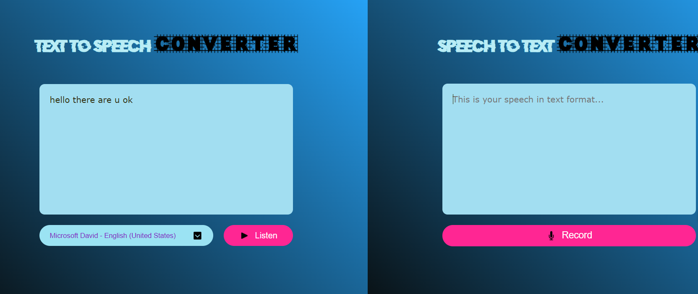

# Speech Synthesis and Recognition App

This app combines both **speech synthesis** (text-to-speech) and **speech recognition** (voice-to-text) functionalities using the Web Speech API. It allows users to convert written text into speech and transcribe spoken words into text.

## Key Features:

1. **Speech Synthesis (Text-to-Speech)**:

   - Uses `SpeechSynthesisUtterance` to convert text input into speech.
   - Allows the user to select a voice from the available voices in the browser and play the entered text.

2. **Voice Recognition (Speech-to-Text)**:
   - Uses the `SpeechRecognition` API (or `webkitSpeechRecognition` for browsers that support it) to capture the user's voice and transcribe it into text.
   - Displays the transcribed speech in real-time within a `textarea`.
   - Provides a button to start and stop recording the voice input.

## Code Functionality Breakdown:

### Speech Synthesis:

- The app fetches all available voices in the browser when the voices change (`onvoiceschanged`).
- Users can select a voice from a dropdown menu (`voiceSelect`).
- The `btnSpeech` button triggers the speech synthesis by reading the text from the `textarea`.

### Speech Recognition:

- The `SpeechRecognition` API is used to capture the user's voice when the `btnRecord` button is clicked.
- Transcription appears live in the `transcript` textarea as the user speaks.
- The app supports starting and stopping voice recognition with the `btnRecord` button.
- If recognition ends while the user is still recording, the process automatically restarts.

### Technologies Used:

- **HTML**: For structure (text input, buttons, and selection of voices).
- **JavaScript**: For handling speech synthesis and speech recognition logic.
- **Web Speech API**: For text-to-speech and voice-to-text capabilities.

